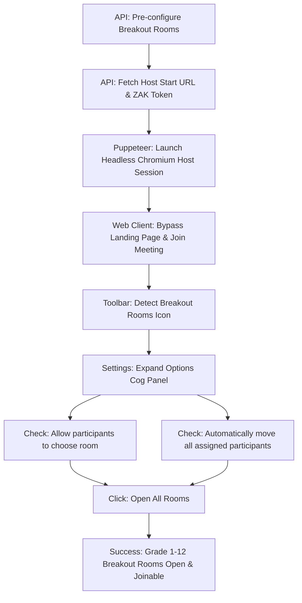

# Zoom Autostart & Breakout Rooms Automator (OpenClaw)

This repository contains the complete automation suite for starting a scheduled Zoom meeting as the Host, configuring breakout rooms, toggling specific meeting options, and launching them live.

---

## 🛠️ Architecture & Flow

The system operates as a headless automated host agent utilizing Zoom REST APIs and Puppeteer browser automation:



---

## 📋 Configured Host Options

To allow seamless participant self-direction, the following options are automatically checked in the meeting control dialog:
1. **Allow participants to choose room** (Enables guest self-selection).
2. **Allow participants to return to the main session at any time**.
3. **Automatically move all assigned participants into breakout rooms** (Ensures immediate routing).

---

## 🚀 Deployment & Management Commands

All processes run on the server under **PM2** to guarantee uptime and scheduled auto-starts.

### PM2 Process Controls
* **Check Status of Services**:
  ```bash
  pm2 status
  ```
* **Restart Services (loads latest code changes)**:
  ```bash
  pm2 restart zoom-scheduler zoom-auto-starter
  ```
* **View Real-Time Logs**:
  ```bash
  pm2 logs zoom-scheduler
  ```

### Manual Trigger Scripts
* **Stop current session, start fresh & open rooms**:
  ```bash
  node stop-start-open-rooms.js
  ```
* **Open breakout rooms on the currently active session**:
  ```bash
  node open-rooms-now.js
  ```
* **Capture live screen diagnostic screenshot**:
  ```bash
  node host-screenshot.js
  ```

---

## ⚠️ Troubleshooting & Web Client Limitations

If guest participants can see the breakout rooms but clicking "Join" does not redirect them, ensure the following settings on their browser/client:

1. **Allow Camera/Microphone Permissions**:
   Browsers block media transitions (like entering breakout rooms) if permissions for microphone/camera are blocked. Click the **Lock 🔒 icon** in the browser URL bar and change them to **Allow**, then refresh.
2. **Join Audio**:
   Verify the guest has successfully clicked **"Join Audio by Computer"** after entering.
3. **Use the Desktop App**:
   For maximum stability, copy the join URL and open it directly inside the **Zoom Desktop Client**.
